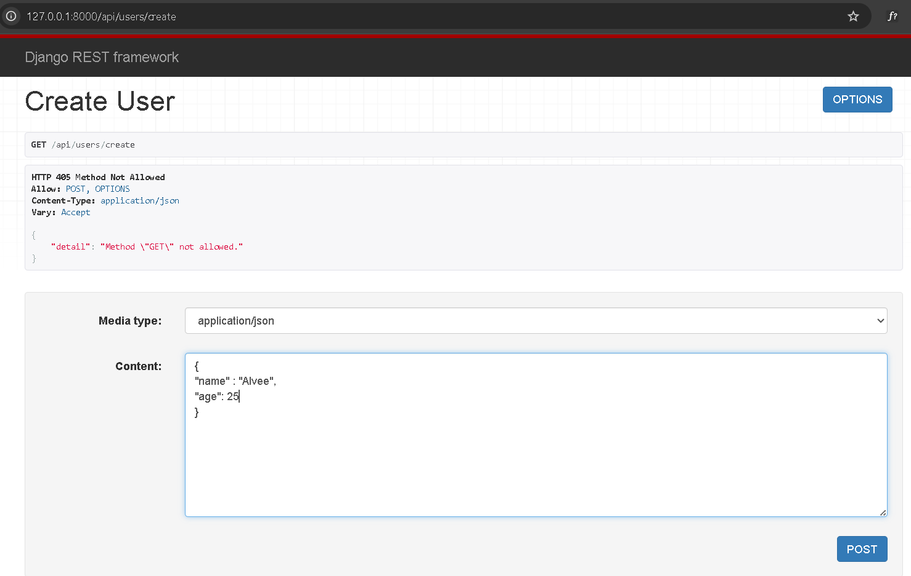

### Django Rest Framework (DRF)

```bash
pip install django djangorestframework
```

```bash
django-admin startproject newproject
```

```bash
cd newproject
```

```bash
python manage.py startapp api
```

then in the settings.py file under the newproject add rest_framework and api in the installed apps

```py
INSTALLED_APPS = [
    'django.contrib.admin',
    'django.contrib.auth',
    'django.contrib.contenttypes',
    'django.contrib.sessions',
    'django.contrib.messages',
    'django.contrib.staticfiles',
    'rest_framework',
    'api',
]
```

In the models.py file under api create our models

```py
class DB_USER(models.Model):
    age =  models.IntegerField()
    name = models.CharField(max_length=100)


    def __str__(self):
        return self.name
```

Now we need to migrate this
for that run the command

```bash
python manage.py makemigrations
```

```bash
python manage.py migrate
```

Now for convert the python data to json data we need a serializer

so create a serializer.py file in api folder

```py
from rest_framework import serializers
from .models import DB_USER

class UserSerializer(serializers.ModelSerializer):
    class Meta:
        model = DB_USER
        fields = '__all__'
```

#### Function Based View (Request and Response)

In function based view we create the function for individual functionalities

views.py

```py
from rest_framework.decorators import api_view
from rest_framework.response import Response
from rest_framework import status
from .models import DB_USER
from .serializer import UserSerializer

@api_view(['GET'])
def get_user(request):
    users = DB_USER.objects.all()
    serializer = UserSerializer(users, many=True)
    return Response(serializer.data)

@api_view(['POST'])
def create_user(request):
    serializer = UserSerializer(data= request.data)
    if serializer.is_valid():
        serializer.save()
        return Response(serializer.data , status=status.HTTP_201_CREATED)
    return Response(serializer.errors, status=status.HTTP_400_BAD_REQUEST)

@api_view(['GET','PUT','DELETE'])
def user_details(request,pk):
    try:
        user = DB_USER.objects.get(pk=pk)
    except DB_USER.DoesNotExist:
        return Response(status=status.HTTP_404_NOT_FOUND)

    if request.method == 'GET':
        serializer = UserSerializer(user)
        return Response(serializer.data)

    elif request.method == 'PUT':
        serializer = UserSerializer(user, data = request.data)
        if serializer.is_valid():
            serializer.save()
            return Response(serializer.data)
        return Response(serializer.errors, status=status.HTTP_400_BAD_REQUEST)

    elif request.method == 'DELETE':
        user.delete()
        return Response(status = status.HTTP_204_NO_CONTENT)

```

Now we need to define the path of the url

For that we create a urls.py in the api folder

```py
from django.urls import path
from .views import get_user,create_user

urlpatterns = [
    path('users/', get_user, name = 'get_user'),
    path('users/create', create_user, name = 'create_user'),
    path('users/<int:pk>', user_details, name = 'user_details')

]
```

Also update the parent url (urls.py in newproject)

```py
urlpatterns = [
    path('admin/', admin.site.urls),
    path('api/', include('api.urls'))
]
```

Now if we run the server by

```bash
python manage.py runserver
```

Now we can create the user by going to the url api/users/create/


And we will go the url /api/users/ we can see the all users and if we go to the /api/users/1 we can see the user details who contains id 1 and from there we can update, delete user


#### Class Based View

In class based view all funcation are combine into a class

replace our views.py to this

```py
from rest_framework.views import APIView
from rest_framework.response import Response
from rest_framework import status
from django.http import Http404
from .models import DB_USER
from .serializer import UserSerializer


class UserList(APIView):
    """
    List all users, or create a new user.
    """

    def get(self, request, format=None):
        users = DB_USER.objects.all()
        serializer = UserSerializer(users, many=True)
        return Response(serializer.data)

    def post(self, request, format=None):
        serializer = UserSerializer(data=request.data)
        if serializer.is_valid():
            serializer.save()
            return Response(serializer.data, status=status.HTTP_201_CREATED)
        return Response(serializer.errors, status=status.HTTP_400_BAD_REQUEST)


class UserDetail(APIView):
    """
    Retrieve, update or delete a user instance.
    """

    def get_object(self, pk):
        try:
            return DB_USER.objects.get(pk=pk)
        except DB_USER.DoesNotExist:
            raise Http404

    def get(self, request, pk, format=None):
        user = self.get_object(pk)
        serializer = UserSerializer(user)
        return Response(serializer.data)

    def put(self, request, pk, format=None):
        user = self.get_object(pk)
        serializer = UserSerializer(user, data=request.data)
        if serializer.is_valid():
            serializer.save()
            return Response(serializer.data)
        return Response(serializer.errors, status=status.HTTP_400_BAD_REQUEST)

    def delete(self, request, pk, format=None):
        user = self.get_object(pk)
        user.delete()
        return Response(status=status.HTTP_204_NO_CONTENT)
```

Now replace urls.py by this

```py
from django.urls import path
from .views import UserList, UserDetail

urlpatterns = [
    # List all users OR create a new user
    path('users/', UserList.as_view(), name='user_list'),

    # Retrieve, update, or delete a specific user
    path('users/<int:pk>/', UserDetail.as_view(), name='user_detail'),
]
```

Now we can acheive the same functionality but with less code


#### Generic Class Based Views

Generic views are prebuilt classes that combine common operations (list, create, retrieve, update, delete)
— so you don’t have to write repetitive code.

```py
from rest_framework import generics
from .models import DB_USER
from .serializer import UserSerializer


class UserList(generics.ListCreateAPIView):
    """
    List all users, or create a new user.
    """
    queryset = DB_USER.objects.all()
    serializer_class = UserSerializer


class UserDetail(generics.RetrieveUpdateDestroyAPIView):
    """
    Retrieve, update, or delete a user instance.
    """
    queryset = DB_USER.objects.all()
    serializer_class = UserSerializer
```

Now We've gotten a huge amount for free, and our code looks like good, clean, idiomatic Django.
And also now we can add data by build in form


